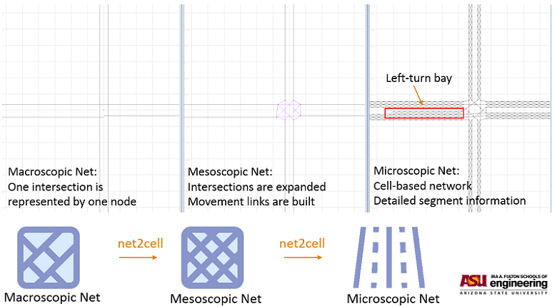
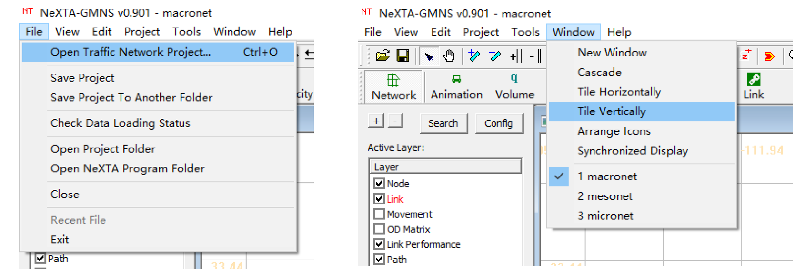
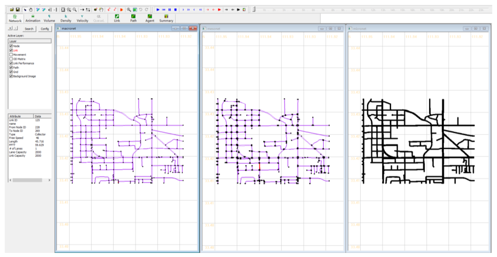

NET2CELL
========

For any given networks that meet the `GMNS`_ standard, net2cell helps users automatically build
mesoscopic and lane-by-lane cell-based microscopic transportation networks to accommdate different
modelling needs.

Installation
------------------------------

.. code-block:: bash

    pip install net2cell

Prepare macroscopic network
------------------------------

net2cell is compatible with any networks that meet the GMNS standard. Users can use their networks
at hand as inputs of net2cell, but converting networks to GMNS format may be needed before
feeding them to net2cell. For a quick start, users are recommended to use `osm2gmns`_ to quickly
get a macroscopic from `OpenStreetMap`_ (OSM). osm2gmns helps users easily convert the OSM map data
to node and link network files in the GMNS format.

Use net2cell
------------------------------

Get hybrid networks

.. code:: python

    >>> import net2cell as nc

    >>> macro_net = nc.readMacroNet()
    >>> nc.generateHybridNets(macro_net)

.. table:: Arguments of function ``readMacroNet()``
    :class: classic

    +-----------------+--------------+-----------+---------------------------------------------------------------------------------------------------------+
    |     Argument    |     Type     |  Default  |                           Comments                                                                      |
    +=================+==============+===========+=========================================================================================================+
    |       cwd       |    string    |     ''    | current working directory                                                                               |
    +-----------------+--------------+-----------+---------------------------------------------------------------------------------------------------------+
    | coordinate_type |      enum    |    'll'   | 'm': meter; 'll': longitude latitude; 'f': feet                                                         |
    +-----------------+--------------+-----------+---------------------------------------------------------------------------------------------------------+
    | geometry_source |      enum    |     'l'   | the file that stores link geometry. 'n': no geometry; 'l': link.csv; 'g': geometry.csv                  |
    +-----------------+--------------+-----------+---------------------------------------------------------------------------------------------------------+
    | unit_of_length  |      enum    |     'm'   | unit of link length. 'm': meter; 'km': kilometer: 'mi': mile; 'f': feet                                 |
    +-----------------+--------------+-----------+---------------------------------------------------------------------------------------------------------+
    |  segment_unit   |      enum    |     'm'   | unit of segment length. 'm': meter; 'km': kilometer: 'mi': mile; 'f': feet                              |
    +-----------------+--------------+-----------+---------------------------------------------------------------------------------------------------------+
    |   speed_unit    |      enum    |    'mph'  | unit of speed. 'mph'; 'kph'                                                                             |
    +-----------------+--------------+-----------+---------------------------------------------------------------------------------------------------------+
    |   link_types    | None or list |    None   | None: all links will be imported; list: only links with link_type in the provided list will be imported |
    +-----------------+--------------+-----------+---------------------------------------------------------------------------------------------------------+
    |  connector_type |  None or int |    None   | None: no connector; int: link type id of connector                                                      |
    +-----------------+--------------+-----------+---------------------------------------------------------------------------------------------------------+
    | min_link_length |     float    |    3.0    | meter. links shorter than min_link_length will be reomved during processing                             |
    +-----------------+--------------+-----------+---------------------------------------------------------------------------------------------------------+
    |     combine     |      bool    |   False   | remove two-degree nodes, and combine corresponding two adjacent links                                   |
    +-----------------+--------------+-----------+---------------------------------------------------------------------------------------------------------+
    |  width_of_lane  |      float   |    3.5    | meter. positive value                                                                                   |
    +-----------------+--------------+-----------+---------------------------------------------------------------------------------------------------------+

Function ``readMacroNet()`` loads and parses the macroscopic network from ``cwd``. Two necessary network files
includes ``node.csv`` and ``link.csv``. Other optional files includes ``movement.csv``, ``segment.csv`` and
``segment.csv``. Users can check the detailed introduction of these files at `GMNS`_ Github homepage.

.. table:: Arguments of function ``generateHybridNets()``
    :class: classic

    +-----------------+--------------+-----------+---------------------------------------------------------------------------------------------------------+
    |     Argument    |     Type     |  Default  |                           Comments                                                                      |
    +=================+==============+===========+=========================================================================================================+
    |   macro_net     |   CInitNet   |           |                                                                                                         |
    +-----------------+--------------+-----------+---------------------------------------------------------------------------------------------------------+
    |  length_of_cell |     float    |    7.0    | meter. positive value                                                                                   |
    +-----------------+--------------+-----------+---------------------------------------------------------------------------------------------------------+
    | auto_connection |     bool     |    True   | True: automatically generate movement information for intersections without that; False: do not generate|
    +-----------------+--------------+-----------+---------------------------------------------------------------------------------------------------------+

Function ``generateHybridNets()`` build the mesoscopic and microscopic network for the loaded macroscopic network.

Visualization
------------------------------
You can visualize generated networks using `NeXTA`_ or `QGis`_.

- NeXTA

    Open networks and synchronized display

    Arizona State University, Tempe Campus

Interested readers can check the `link`_ for our online transportation modelling visualization platform, in which
network data is provided by net2cell.

Next
------------------------------
The potential next step is to manage OD zone structure and in the NeXTA tool and perform traffic assignment and
simulation using `DTALite`_ for transportation network simulation and analysis.

.. _`GMNS`: https://github.com/zephyr-data-specs/GMNS
.. _`osm2gmns`: https://osm2gmns.readthedocs.io/
.. _`OpenStreetMap`: https://www.openstreetmap.org
.. _`NeXTA`: https://github.com/xzhou99/NeXTA-GMNS
.. _`QGis`: https://qgis.org
.. _`link`: https://github.com/xzhou99/Dtalite_traffic_assignment
.. _`DTALite`: https://github.com/xzhou99/Dtalite_traffic_assignment